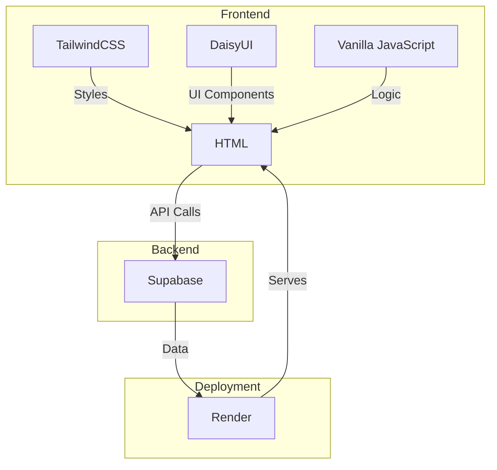

# Fitness Tracking App

Welcome to the Fitness Tracking App! This project is designed to help users set and achieve their fitness goals while engaging with a community of like-minded individuals. The app tracks progress, supports goal setting, and provides community features that enhance the user experience.

## Key Features

- **Goal Setting:** Users can define their personal fitness goals.
- **Progress Tracking:** Users can monitor their goal progress over time.
- **Community Features:** Users can find and follow other learners to share and gain motivation.

## Stack

- **Frontend:** TailwindCSS, DaisyUI, HTML, Vanilla JavaScript
- **Backend:** Supabase
- **Deployment:** Render

## High-Level System Overview



## Getting Started

To contribute to or use this project, follow the steps below:

### Prerequisites

- Node.js
- npm (Node Package Manager)
- Supabase account
- Render account

### Installation

1. **Clone the Repository:**
   ```sh
   git clone https://github.com/JazziB14/fitness-tracking-app.git
   ```
2. **Navigate to the project directory:**
   ```sh
   cd fitness-tracking-app
   ```
3. **Install Dependencies:**
   ```sh
   npm install
   
   ```
4. **Run the App:**
   ```sh
   npm run dev
   ```

## Contributing

Contributions are welcome! Please open an issue or submit a pull request for any features, bugs, or enhancements.

## License

This project is licensed under the MIT License. See the [LICENSE](LICENSE) file for details.

## Contact

For any inquiries, please reach out to [your-email@example.com](mailto:your-email@example.com).